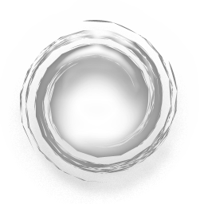

# Screna
  
.Net Capture Solution to Capture Screen/Audio/Video/Mouse Cursor/KeyStrokes and more...

Screna provides a highly extensible API to develop Capturing Apps.

# API
Screna is highly based on the use of `Interfaces`.  
An appreciable understanding of Interfaces is assumed.

> Screna.Audio API is documented in the [here](Audio/README.md).

* ## IVideoFileWriter
Encodes individual frames into a Video.  
  * AviWriter
  * GifWriter

* ## IImageProvider
Implementing classes capture individual frames from a source.  
`Returned images must be in PixelFormat.FormatRgb32bppRgb.`  
A potential example is a WebCamProvider.  
  * WindowProvider
  * ScreenProvider

* ## IRecorder
Carries out the process of recording the Audio and/or Video.  
  * Recorder
  * AudioAloneRecorder  
  Records audio from an IAudioProvider and writes it to an IAudioFileWriter
  * UnconstrainedFrameRateGifRecorder

* ## IOverlay
Draws over a captured image.  
  * MouseCursor
  * MouseKeyHook

# Examples
> [Captura](https://github.com/MathewSachin/Captura) is a Capture application demonstrating all the features of Screna.

See [Learn.md](Learn.md)

# Acknowledgements
* Screna.Audio is derived from [NAudio](https://github.com/NAudio/NAudio) by Mark Heath licensed under Microsoft Public License.
* Screna.Avi is derived from [SharpAvi](https://github.com/baSSiLL/SharpAvi) by Vasilli Massilov licensed under the MIT License.
* Screna.MouseKeyHooking is derived from [MouseKeyHook](https://github.com/gmamaladze/globalmousekeyhook) by George Mamaladze.
